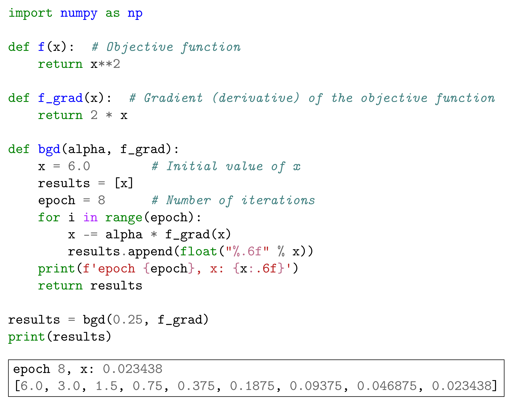
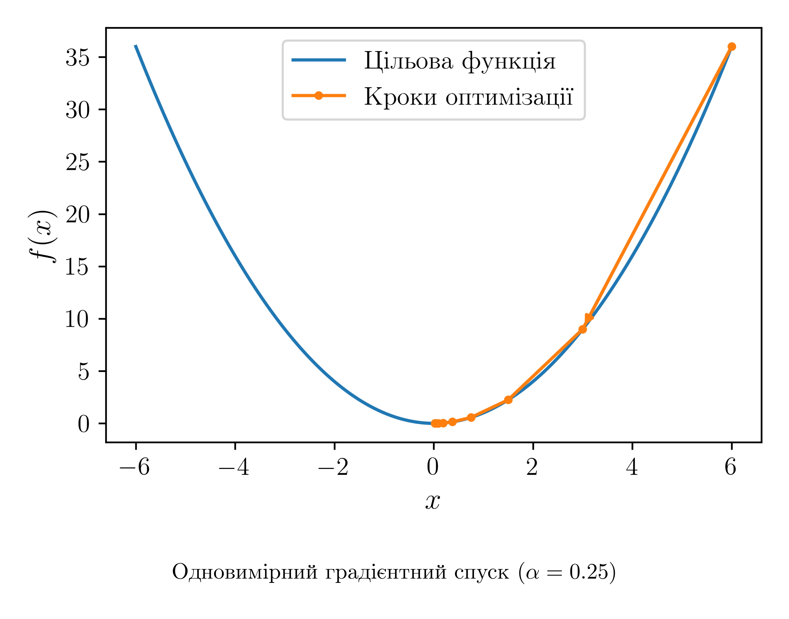
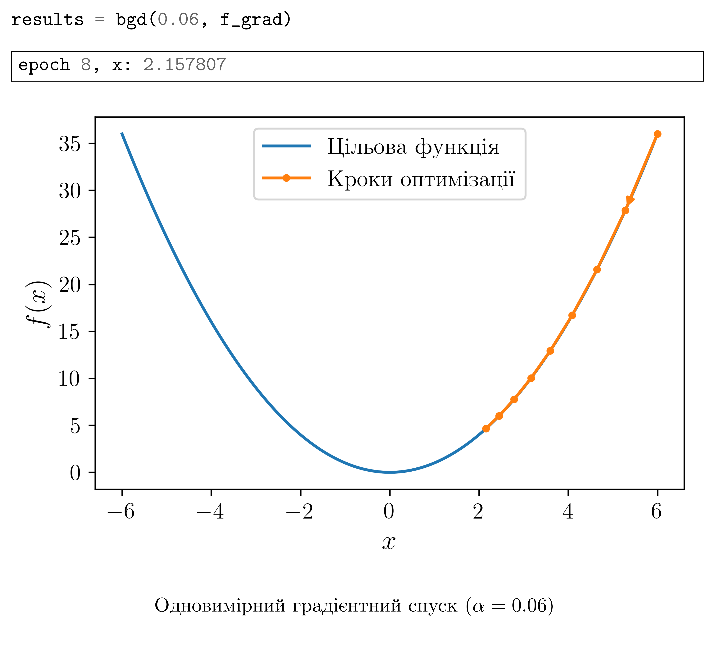
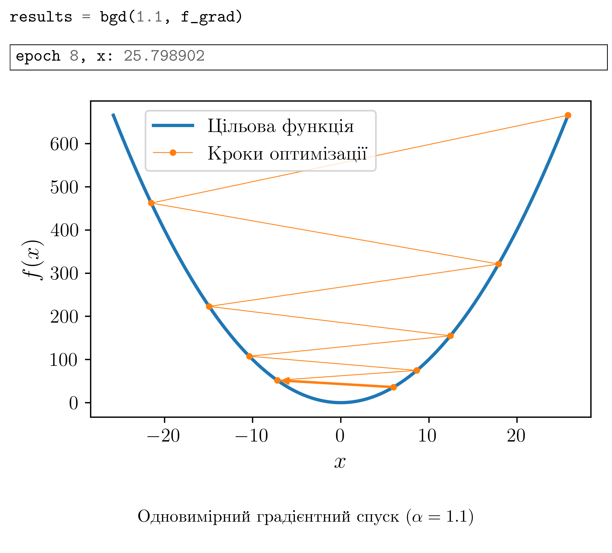
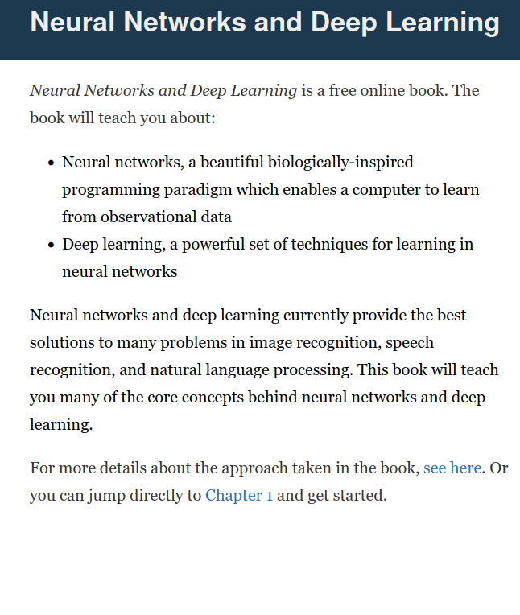

class: middle, center, title-slide 

# Системи штучного інтелекту

Лінійна регресія

  
Кочура Юрій Петрович 
[iuriy.kochura@gmail.com](mailto:iuriy.kochura@gmail.com)  
<a href="https://t.me/y_kochura">@y_kochura</a>  

---

class: blue-slide, middle, center
count: false

.larger-xx[Пайплайн]

---

class: middle 

1. .bold[Збір датасету]
1. .bold[Створення алгоритму машинного навчання] (лінійна регресія, логістична регресія, машина опорних векторів, нейронна мережа, ... )
1. .bold[Ініціалізація параметрів]
1. .bold[Вибір функції втрат та оптимізаційного алгоритму]
1. .bold[Повторити $n$ разів:]

  .smaller-x[
  5.1. Пропустити $k$ прикладів з датасету через алгоритм

  5.2. Обчислити цільову функцію (усереднене значення функції втрат для $k$ прикладів)

  5.3. Обчислити градієнти цільової функції відносно навчальних параметрів використовуючи правило ланцюжка

  5.4. Оновити навчальні параметри відповідно до правила оптимізаційного алгоритму]  

---

class: blue-slide, middle, center
count: false

.larger-xx[Одновимірний градієнтний спуск]

---

class: middle
.larger-x[
$$
\nabla f(\left.x\_{1}, x\_{2}, \ldots, x\_{n}\right)=\left[\begin{aligned}\begin{array}{c}\dfrac{\partial f}{\partial x\_1}(\left.x\_{1}, x\_{2}, \ldots, x\_{n}\right)\\\\[18pt]
\dfrac{\partial f}{\partial x\_2}(\left.x\_{1}, x\_{2}, \ldots, x\_{n}\right)\\\\[18pt]
\vdots \\\\
\dfrac{\partial f}{\partial x\_n}(\left.x\_{1}, x\_{2}, \ldots, x\_{n}\right)
\end{array}\end{aligned}\right]
$$
]

---

class: middle

## Одновимірний градієнтний спуск
.smaller-x[

Розглянемо деяку неперервну диференційовану дійсну функцію $f: \mathbb{R} \rightarrow \mathbb{R}$. Розкладаючи у ряд Тейлора, ми отримуємо:

$$f(x + \varepsilon) = f(x) + \varepsilon f^{'}(x) + \mathcal{O}(\varepsilon^2)$$

Щоб усе було просто, давайте виберемо фіксований розмір кроку $\alpha > 0$ та оберемо $\varepsilon = -\alpha f^{'}(x)$. Підставляючи це у ряд Тейлора, отримаємо:

$$f(x -\alpha f^{'}(x)) = f(x) - \alpha f^{'2}(x)  + \mathcal{O}(\alpha^2 f^{'2}(x))$$

Якщо похідна $f^{'}(x) \neq 0$ не зникає ми робимо прогрес так як $\alpha f^{'2}(x) > 0$. Крім того, ми завжди можемо вибрати $\alpha$ досить малим, щоб вирази вищих порядків стали нерелевантними. Тому ми приходимо до

$$f(x -\alpha f^{'}(x)) \lessapprox f(x)$$

Це означає, якщо ми використовуємо

$$x \leftarrow x -\alpha f^{'}(x)$$

для ітерації по $x$, значення функції  $f(x)$  може зменшитись. 
]

???
Gradient descent in one dimension is an excellent example to explain why the gradient descent algorithm may reduce the value of the objective function.

The Taylor series is used to describe what the function looks like in the neighborhood of some poin $x$.

That is, in first-order approximation $f(x + \varepsilon)$  is given by the function value $f(x)$ and the first derivative $f^{'}(x)$ at $x$. It is not unreasonable to assume that for small $\varepsilon$ moving in the direction of the negative gradient will decrease $f$. 

Therefore, in gradient descent we first choose an initial value $x$ and a constant $\alpha > 0$ and then use them to continuously iterate $x$ until the stop condition is reached, for example, when the magnitude of the gradient $|f^{'}(x)|$ is small enough or the number of iterations has reached a certain value.

---

class: middle

.center[
.width-80[]
]

???

For simplicity we choose the objective function $f(x) = x^2$ to illustrate how to implement gradient descent. Although we know that $x = 0$ is the solution to minimize $f(x)$, we still use this simple function to observe how $x$ changes.

---

class: middle

The progress of optimizing over $x$ 

.center[
.width-80[]
]

---

class: middle

The progress of optimizing over $x$ 

.center[
.width-80[]
]

???
If we use a learning rate that is too small, it will cause $x$ to update very slowly, requiring more iterations to get a better solution.

---

lass: middle

The progress of optimizing over $x$ 

.center[
.width-80[]
]

???
if we use an excessively high learning rate, $|\alpha f^{'}(x)|$ might be too large for the first-order Taylor expansion formula. That is, the term $\mathcal{O}(\alpha^2 f^{'2}(x))$ might become significant. In this case, we cannot guarantee that the iteration of $x$ will be able to lower the value of $f(x)$.

---
class: middle

# Викладач з практик

.center[
.circle.width-40[]
]

.center.bold.larger-x[Кочура Юрій Петрович]
- Кафедра обчислювальної техніки, ФІОТ

---

class: middle

# Опис предмету

.width-100[]

???
Штучний інтелект (ШІ) – це галузь комп’ютерних наук, яка зосереджена на створенні систем, що здатні виконувати завдання, які зазвичай потребують людського інтелекту. ШІ використовує методи та алгоритми, які спроектовані для вивчення, моделювання та реалізації інтелектуальних функцій, таких як розпізнавання образів, мовний аналіз та прийняття рішень. Малий та великий бізнес в усьому світі використовує штучний інтелект для вирішення своїх найбільших викликів. Медичні працівники використовують штучний інтелект для більш точної та швидшої діагностики пацієнтів. Підприємства роздрібної торгівлі використовують його, щоб пропонувати клієнтам персоналізований досвід покупок. Автовиробники використовують ШІ, щоб зробити транспортні засоби безпечнішими та ефективнішими. Основні аспекти ШІ включають в себе розробку алгоритмів та навчання систем на основі даних. Сьогодні ШІ є однією з найпотужніших та швидкозростаючих технологій нашого часу.

Ідея штучного інтелекту з'явилася в 1950-х, коли група ентузіастів із галузі інформатики, що тільки зароджувалась, задалися питанням, чи можна змусити комп'ютери «думати», — питанням, яке ми вивчаємо досі. Коротко цю область можна визначити так: автоматизація інтелектуальних завдань, які зазвичай виконують люди. Хоча багато основних ідей виношувалися роками й навіть десятиліттями раніше, «штучний інтелект» остаточно викристалізувався як галузь досліджень у 1956 році, коли Джон Маккарті, на той час молодий доцент кафедри математики Дартмутського коледжу, організував літній семінар.

Відповідно, ШІ - це область, що охоплює машинне навчання і глибоке навчання, а також включає багато підходів, не пов'язані з навчанням. Наприклад, перші програми для гри в шахи працювали за жорстко визначеними правилами, заданими програмістами, і не могли кваліфікуватися як машинне навчання. Довгий час багато експертів вважали, що ШІ рівня людини можна створити, якщо дати програмісту достатній набір явних правил для маніпуляції даними. Цей похід, відомий як символьний ШІ, і являв собою домінуючу парадигму ШІ з 1950-х до кінця 1980-х. Пік його популярності прийшов на бум експертних систем в 1980-х.

Символьний ШІ чудово справлявся з вирішенням чітко визначених логічних завдань, таких як гра в шахи, але, як виявилося, неможливо задати строгі правила для вирішення більш складних, нечітких завдань, таких як класифікація зображень, розпізнавання мови та переклад тексту. На зміну символьному ШІ прийшов новий підхід: машинне навчання.

---

class: middle

# Класичне програмування vs машинне навчання

.center[
.width-100[]
]

???

Комп’ютери та обчислення допомагають нам досягати бiльш складних цiлей i кращих результатiв у вирiшеннi
проблем, нiж ми могли б досягти самi. Однак, багато сучасних завдань вийшли за рамки обчислень через один
основний обмежуючий фактор: традицiйно, комп’ютери можуть дотримуватися лише конкретних
вказiвок/iнструкцiй, якi їм дають.

Вирiшення проблем з програмування вимагає написання конкретних покрокових iнструкцiй, якi має виконувати комп’ютер. Ми називаємо цi кроки алгоритмами. У цьому випадку, комп’ютери можуть допомогти нам
там, де ми:
1. Розумiємо як вирiшити проблему.
2. Можемо описати проблему за допомогою чiтких покрокових iнструкцiй, якi комп’ютер може зрозумiти.

Методи машинного навчання дозволяють комп’ютерам “учитися” на прикладах. Вирiшення проблем iз застосуванням машинного навчання вимагає виявлення деякого шаблону, а потiм, коли такий шаблон готовий, дозволяють, наприклад, нейроннiй мережi вивчити карту переходiв мiж вхiдними та вихiдними даними. Ця особливiсть вiдкриває новi типи проблем, де комп’ютери можуть допомогти нам у їх розв’язаннi, за умови, коли ми:
1. Визначили шаблон проблеми.
2. Маємо достатньо даних, що iлюструють шаблон.
---

class: middle

# Навчальна мета

- Навчитись визначати типи проблем до яких застосовуються методи штучного інтелекту.
- Дізнатись про основні методи та інструменти, необхідні для навчання моделей ШІ.
- Отримати досвід розробки простих систем, які навчаються на досвіді.

---

class: middle 
# Потрібні навички

- Рівень володіння англійською мовою не нижче А2.
- .bold[Математика]: знання та вміння використовувати обчислення, аналітичну геометрію, лінійну алгебру та теорію ймовірностей.
- .bold[Програмування]: вміння програмувати на Python.

---

class: middle 
# Заняття з практик

- Практики в асинхронному режимі онлайн 
- Семінар в синхронному режимі онлайн на платформі .bold[*BigBlueButton*]:   [https://bbb.comsys.kpi.ua/b/yur-epq-or2-crj](https://bbb.comsys.kpi.ua/b/yur-epq-or2-crj)

.center.width-100[]

---

class: middle

# Оголошення та обговорення

.smaller-x[Усі *оголошення* та *обговорення* будуть здійснюватись в Telegram (повідомте мене, якщо потрібно Вас додати)

- Задавайте питання, які Вас турбують
- Не соромтесь!
]

.grid[
.kol-1-2[
.center.width-60[]
.center.smaller-x[Оголошення]
]

.kol-1-2[
.center.width-60[]
.center.smaller-x[Обговорення]
]
]

---

class: middle

# Підручники

 Для всеосяжного ознайомлення з ШІ:

.grid[
.kol-1-3[
[.center.width-80[]](https://www.deeplearningbook.org/)
.center[Безкоштовна]
]

.kol-1-3[
[.center.width-95[]](http://neuralnetworksanddeeplearning.com/index.html)
.center[Безкоштовна]
]

.kol-1-3[
[.center.width-80[]](https://www.manning.com/books/deep-learning-with-python-second-edition?query=deep/)
.center[Безкоштовний перегляд]
  ]
]

---

class: middle

# Практичні роботи

Вправи, які допоможуть познайомитись з предметом.

---

class: middle

# Оцінювання

- 30%  &nbsp;&emsp; Практичнi завдання (10% кожне)
- 30%  &nbsp;&emsp; Семінар

**Примітка!** Умова допуску до семестрового контролю: 
 .center[*Практичні + Семінар* $\geq 36\%$]

---

class: middle 
# Шкала оцінок

Шкала оцiнок [КПI iм. Iгоря Сiкорського](https://kpi.ua/grading):

.center.width-65[]

---

class: blue-slide, middle, center
count: false

.larger-xx[Кодекс честі]

---

class: middle 

# Академічна доброчесність

Ви можете обговорювати завдання практичних робiт у групах. Однак, кожен студент(-ка)
повинен(-на) пiдготувати розв’язки завдань самостiйно. Пiд час проходження цього курсу Ви
зобов’язанi дотримуватись політики та принципів академічної доброчесності визначених
Кодексом честi КПI iм. Iгоря Сiкорського ([Детальніше Розліл 3](https://kpi.ua/code)) та усi наступнi
правила:

1. Кожен з Вас повинен вiдправляти на перевiрку власно виконану роботу. Використання чужих розв’язкiв або програмного коду i представлення їх за свої напрацювання є плагiатом та серйозним порушенням основних академiчних стандартiв.

1. Ви не повиннi дiлитися своїми розв’язками з iншими студентами, а також просити iнших дiлитися своїми розв’язками з Вами.

1. Якщо Ви отримували допомогу у вирiшеннi певного завдання, Ви маєте зазначити це у звiтi, а саме: вiд кого та яку допомогу отримали.

---

class: middle 

# Норми етичної поведінки

Норми етичної поведінки студентів і працівників університету визначені у [розділі 2 Кодексу честі](https://kpi.ua/code) 
Національного технічного університету України «Київський політехнічний інститут імені Ігоря
Сікорського».

---

class: middle 

# Виконання завдань: практики та семінар

Викладачем встановлюється граничний термін для виконання усіх видів завдань з метою послідовного і збалансованого засвоєння студентами навчального матеріалу та моніторингу виконання здобувачами індивідуальних навчальних планів згідно з графіком навчального процесу. Здача на перевірку виконаних завдань після встановлених термінів
супроводжується штрафними балами. Кінцевим терміном для здачі на перевірку усіх видів завдань є останнє заняття з комп’ютерного практикуму. У період проведення в університеті
семестрового контролю приймання завдань не здійснюється. Студент(-ка) має можливість переробити або доопрацювати завдання на перездачі з метою підвищення
свого поточного рейтингу.

---

class: middle 

# Процедура оскарження оцінок

Якщо студент(-ка) вважає, що його(її) роботу недооцінено або переоцінено — потрібно
звернутися до викладача, який здійснював оцінювання та повідомити про це із зазначенням
короткого обґрунтування (оцінка буде переглянута).

---

class: blue-slide, middle, center
count: false

.larger-xx[Як успішно завершити курс?]

???
Викладач зацікавлений у тому, щоб усі досягли успіху під час вивчення дисципліни та дізналися якомога більше не лише про “зміст предмету”, а й про те, як ми можемо покращити світ навколо нас. 

---

class: middle 

  - Визначте пріоритети
    - Використовуйте свій час та енергію так, щоб могли досягти поставлених цілей у навчанні, роботі та власному житті.

---

class: middle 

.gray-t[
- Визначте пріоритети
  - Використовуйте свій час та енергію так, щоб могли досягти поставлених цілей у навчанні, роботі та власному житті.]
- Працюйте систематично
  - Подібно до спортивних тренувань, навчання вимагає систематичності та регулярності для того, щоб досягти реального прогресу.

---

class: middle 

.gray-t[
- Визначте пріоритети
  - Використовуйте свій час та енергію так, щоб могли досягти поставлених цілей у навчанні, роботі та власному житті.
- Працюйте систематично
  - Подібно до спортивних тренувань, навчання вимагає систематичності та регулярності для того, щоб досягти реального прогресу.]
- Спілкуйтеся з однодумцями
  - Знайдіть друга з яким зможете обговорювати матеріали лекцій і не тільки. Слідкуйте за людьми, трудовою етикою яких Ви захоплюєтесь &mdash; успішні люди надихають.

---

class: middle 

.gray-t[
- Визначте пріоритети
  - Використовуйте свій час та енергію так, щоб могли досягти поставлених цілей у навчанні, роботі та власному житті.
- Працюйте систематично
  - Подібно до спортивних тренувань, навчання вимагає систематичності та регулярності для того, щоб досягти реального прогресу.
- Спілкуйтеся з однодумцями
  - Знайдіть друга з яким зможете обговорювати матеріали лекцій і не тільки. Слідкуйте за людьми, трудовою етикою яких Ви захоплюєтесь &mdash; успішні люди надихають.]
- Залишайтесь духовно та фізично здоровими
  - Навчаючись онлайн, швидше за все, Ви будете проводите більше часу за комп’ютером, ніж це було б під час офлайн навчання, тому не забувайте робити перерви, ходити на прогулянки, спати рекомендовану кількість годин та їсти здорову їжу для підтримання свого організму.

---

class: end-slide, center
count: false

.larger-xx[Почнемо 🎬⏳] 